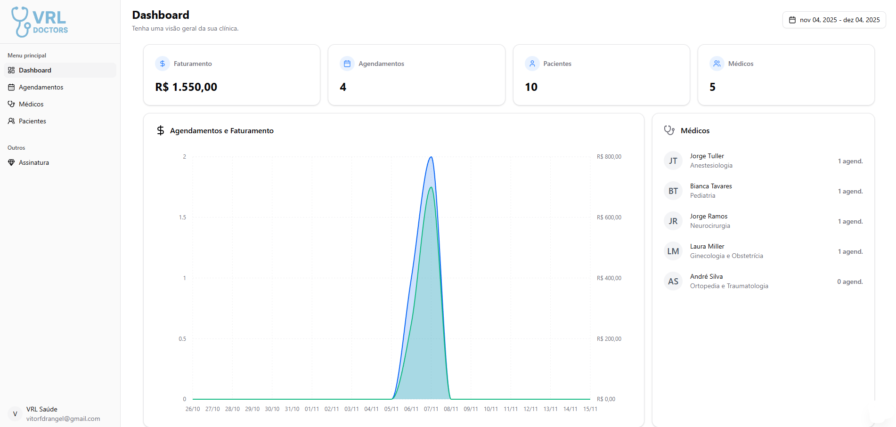

# 🏥 VRL - Doctors: SaaS para Clínicas Médicas



O **VRL - Doctors** é uma aplicação **SaaS (Software as a Service)** desenvolvida para clínicas médicas que desejam gerenciar seus profissionais, pacientes e agendamentos de forma simples, moderna e segura.

Com o VRL - Doctors, é possível registrar médicos e pacientes, agendar consultas, processar pagamentos online e acompanhar o funcionamento da clínica em tempo real.

---

## 🚀 Tecnologias Utilizadas

O projeto foi desenvolvido com a stack moderna do ecossistema **Next.js** e ferramentas robustas para autenticação, banco de dados e pagamentos:

- **Next.js** — Framework React para renderização híbrida (SSR/SSG)
- **TailwindCSS** — Estilização rápida e responsiva
- **PostgreSQL** — Banco de dados relacional
- **Drizzle ORM** — Mapeamento e migrações tipadas e seguras
- **Better Auth** — Autenticação moderna e segura para aplicações Next.js
- **Stripe** — Integração de pagamentos e gestão de planos de assinatura

---

## 🩺 Funcionalidades Principais

- 👨‍⚕️ **Cadastro de Médicos**  
  Permite registrar médicos com informações de nome, especialidade, preço da consulta e horários disponíveis.

- 👩‍🦰 **Cadastro de Pacientes**  
  Armazena dados pessoais de forma segura e organizada.

- 📅 **Agendamento de Consultas**  
  Interface intuitiva para marcar, visualizar e gerenciar consultas médicas.

- 💳 **Pagamentos via Stripe**  
  Suporte a pagamentos e planos de assinatura para clínicas e profissionais.

- 🔐 **Autenticação Segura (Better Auth)**  
  Controle de acesso somente para administradores.

- 📊 **Dashboard Interativa com Gráficos**  
  Painel administrativo com **gráficos dinâmicos** que facilitam a visualização de métricas da clínica, como número de consultas, médicos com maior número de consultas, especialidades mais procuradas, receita mensal, etc.

---

## ⚙️ Instalação e Configuração

1. **Clone o repositório:**

```bash
   git clone https://github.com/seu-usuario/medcare.git
   cd medcare
```

2. Instale as dependências:

```bash
npm install --legacy-peer-deps
```

3. Configure as variáveis de ambiente:
   Crie um arquivo .env.local na raiz do projeto com as chaves:

```bash
DATABASE_URL="sua_url_mongodb"
BETTER_AUTH_SECRET="sua_senha_better-auth"
BETTER_AUTH_URL="http://localhost:3000"

GOOGLE_CLIENT_ID="sua_google_client_id"
GOOGLE_CLIENT_SECRET="sua_google_client_secret"

NEXT_PUBLIC_STRIPE_PUBLISHABLE_KEY="sua_stripe_publishable_key"
STRIPE_SECRET_KEY="sua_stripe_secret_key"
STRIPE_ESSENTIAL_PLAN_PRICE_ID="stripe_id_do_produto"
STRIPE_WEBHOOK_SECRET="webhook_gerado"

NEXT_PUBLIC_APP_URL="http://localhost:3000"
NEXT_PUBLIC_STRIPE_CUSTOMER_PORTAL_URL="stripe_url_do_portal_do_cliente"
```

4. Execute as migrações do banco de dados:

```bash
npm run db:push
```

5. Inicie o servidor de desenvolvimento:

```bash
npm run dev
```

6. Acesse o app em: http://localhost:3000

---

💰 Planos e Pagamentos

O sistema utiliza o Stripe para processar pagamentos de forma segura.
Os administradores podem definir planos de assinatura para clínicas e profissionais.

---

🔒 Segurança e Privacidade

Dados sensíveis são criptografados.

Controle de acesso baseado em papéis.

Conformidade com boas práticas de LGPD (Lei Geral de Proteção de Dados).

---

📄 Licença

Este projeto está sob a licença MIT.

Acesse o Saas clicando no link: (vrl-doctors)[https://vrl-doctors.vercel.app]
